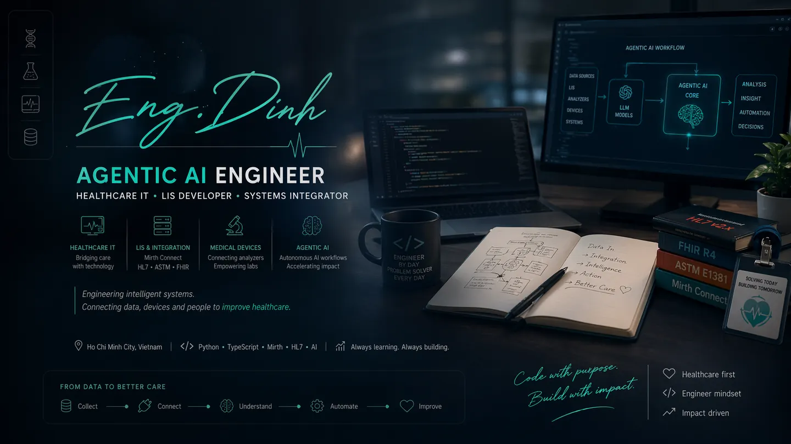
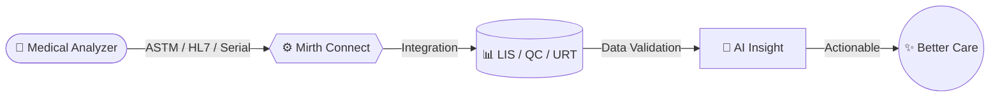

<div align="center">
  
</div>

<div align="center">
  <h3>ENG.DINH</h3>
  <p><i>Building the bridge between medical devices, clinical data and intelligent systems.</i></p>
  <p><b>Healthcare Integration Engineer</b> specializing in LIS, medical device connectivity, Mirth Connect, HL7/ASTM interfaces, and Bio-Rad QC/URT workflows.</p>
</div>

<div align="center">
  <a href="https://git.io/typing-svg"></a>
</div>

<div align="center">
  <a href="https://www.linkedin.com/in/sang-dinh-a31856160/"></a>
  <a href="https://www.facebook.com/hoangsang2020/"></a>
</div>

---

## 🧬 From Device to Care

> *"Bridging the gap between raw machine signals and clinical decisions."*



---

## 🔌 Device Connectivity Experience

| Area | Devices / Systems |
| --- | --- |
| Urinalysis | Analyticon Urilyzer 100 Pro, 500 Pro, Auto |
| Chemistry | Furuno CA270, CA400, CA800; EXIAS e\|1; Elitech analyzers |
| Hematology | Nihon Kohden MEK9100, MEK7300, MEK13xx (certified) |
| Renal Replacement | Baxter Prismaflex, PrisMax |
| QC / URT | Bio-Rad QC / URT management system integration |
| Multi-vendor | Broad hands-on experience connecting Bio-Rad and other laboratory analyzers into quality management workflows |

---

## 🧑‍💻 About Me

```yaml
name: "ĐINH HOÀNG SÁNG (ENG.DINH)"
role: "Healthcare Integration Engineer"
focus: "LIS • Medical Device Connectivity • Mirth Connect • HL7/ASTM • QC/URT • Agentic AI"
mission: "Building the bridge between medical devices, clinical data and intelligent systems"
location: "Ho Chi Minh City, Vietnam 🇻🇳"
education: "B.Eng Biomedical Engineering — International University (VNU-HCM)"
experience: "3+ years"

what_i_do:
  - "LIS software development & lab analyzer connectivity"
  - "Mirth Connect integration — HL7/ASTM/FHIR channels"
  - "Medical device interfacing (analyzers, POCT, serial/TCP)"
  - "Connecting multi-vendor laboratory analyzers into Bio-Rad QC/URT systems"
  - "Clinical tools & healthcare software"
  - "Applied agentic AI for healthcare integration workflows"
  - "TradingView indicators & quantitative scripts"
```

---

## 🚀 My Professional Journey

<div align="left">

- **2017 — 2021 | 🎓 Biomedical Engineering Foundation**  
  Studied **B.Eng Biomedical Engineering** at VNU-HCM, with a focus on medical informatics, image processing, and clinical technology systems.

- **2021 — 2021 | 💡 AI Development Internship**  
  Worked on **deep learning** and computer vision workflows for clinical diagnosis and medical image analysis.

- **2021 — 2022 | 🤖 AI Engineer**  
  Built computer vision solutions for clinical research and diagnostic support, bridging biomedical knowledge with applied AI engineering.

- **2022 — Present | 🏥 Healthcare IT & Systems Engineer**  
  Driving integration at a leading **Medical Device Company**, connecting laboratory analyzers to LIS, QC, and URT systems through **HL7/ASTM**, serial/TCP, and Mirth Connect workflows.

</div>

---

## ⚡ Tech Stack & Systems

> **Healthcare Integration Architecture**
> 
> - **Devices:** `Analyticon Urilyzer` • `Furuno CA270/400/800` • `EXIAS e|1` • `Nihon Kohden MEK` • `Elitech` • `Baxter Prismaflex/PrisMax` • `Bio-Rad`
> - **Protocols:** `ASTM E1381/E1394` • `HL7 v2.x` • `FHIR R4` • `TCP/IP` • `RS-232`
> - **Middleware:** `Mirth Connect` • `Python` • `FastAPI` • `SQL Server` • `Bio-Rad QC/URT`
> - **Intelligent Systems:** `Agentic AI` • `Clinical NER` • `Automation` • `Data Validation`

<br/>

<details>
<summary><b>🛠️ Comprehensive Tech Stack (Click to expand)</b></summary>
<br/>

<div align="center">

**Integration & AI:**<br/>


**Languages:**<br/>


**Backend & Web:**<br/>


**Tools:**<br/>


</div>
</details>

---

<details>
<summary><b>📜 Certifications</b></summary>
<br/>

**2022**

| #   | Course                                                      |                                                                                                                                                  |
| --- | ----------------------------------------------------------- | ------------------------------------------------------------------------------------------------------------------------------------------------ |
| 1   | Python Project for Data Engineering                         | [](https://www.coursera.org/account/accomplishments/certificate/VA42PVC5YYX4) |
| 2   | Introduction to Data Engineering                            | [](https://www.coursera.org/account/accomplishments/certificate/GGJK87NA7UF3) |
| 3   | Introduction to Docker : The Basics                         | [](https://www.coursera.org/account/accomplishments/certificate/B9KZ6PAKMFF7) |
| 4   | AI for Medical Prognosis                                    | [](https://www.coursera.org/account/accomplishments/certificate/NKCSECA9929H) |
| 5   | Python Data Structures                                      | [](https://www.coursera.org/account/accomplishments/certificate/DFDNJD3F8UDJ) |
| 6   | Programming for Everybody (Getting Started with Python)     | [](https://www.coursera.org/account/accomplishments/certificate/MCQNC2PJB3TB) |
| 7   | Linux and Bash for Data Engineering                         | [](https://www.coursera.org/account/accomplishments/certificate/XT4XVKF79JMQ) |
| 8   | Python for Data Science, AI & Development                   | [](https://www.coursera.org/account/accomplishments/certificate/WBJSFA4KRTKB) |
| 9   | Build a Data Science Web App with Streamlit and Python      | [](https://www.coursera.org/account/accomplishments/certificate/LTMZ5SV5J36Q) |
| 10  | Hyperparameter Tuning with Keras Tuner                      | [](https://www.coursera.org/account/accomplishments/certificate/FEVUFPUQJS3H) |
| 11  | Deep Learning with PyTorch : Object Localization            | [](https://www.coursera.org/account/accomplishments/certificate/GLQMSMFNY2SL) |
| 12  | Deep Learning with PyTorch : Generative Adversarial Network | [](https://www.coursera.org/account/accomplishments/certificate/YHVDC6XBFE9A) |
| 13  | Data Visualization using Plotly                             | [](https://www.coursera.org/account/accomplishments/certificate/NWK2AERGVDTJ) |
| 14  | Deep Learning with PyTorch : Image Segmentation             | [](https://www.coursera.org/account/accomplishments/certificate/Z6PPVGV6NNHT) |

**2020**

| #   | Course                                                                                 |                                                                                                                                    |
| --- | -------------------------------------------------------------------------------------- | ---------------------------------------------------------------------------------------------------------------------------------- |
| 1   | Improving Deep Neural Networks: Hyperparameter Tuning, Regularization and Optimization | [](https://coursera.org/share/7f5c7c8b598ba2f7e90c54726b5a995a) |
| 2   | Neural Networks and Deep Learning                                                      | [](https://coursera.org/share/b3a3815dfe1fca3744e6b86261c1d8b1) |
| 3   | Convolutional Neural Networks                                                          | [](https://coursera.org/share/0c3d7a83201d18698df6563471970781) |

</details>

---

## 📈 GitHub Stats

<div align="center">
  
  
</div>

---

<div align="center">
  
</div>

<div align="center">
  <sub><i>"Build fast, ship faster."</i></sub>
</div>
