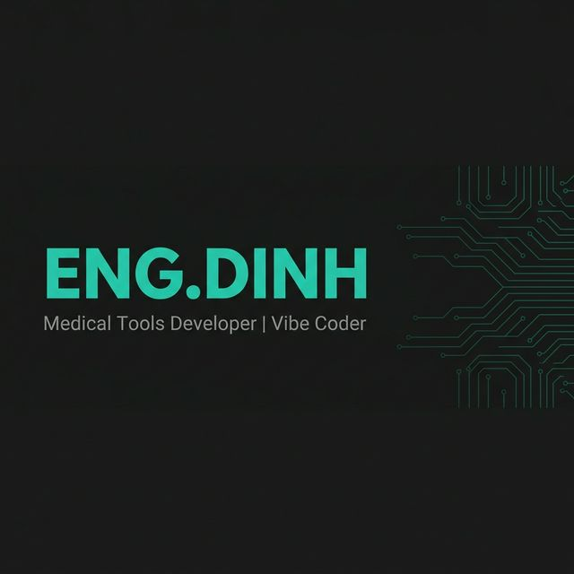

<div align="center">
  
</div>

<div align="center">
  <a href="https://git.io/typing-svg"></a>
</div>

<div align="center">
  <a href="https://www.linkedin.com/in/sang-dinh-a31856160/"></a>
  <a href="https://www.facebook.com/hoangsang2020/"></a>
</div>

---

## 🧑‍💻 About Me

```yaml
name: "ĐINH HOÀNG SÁNG (ENG.DINH)"
role: "Healthcare IT Developer — LIS & Medical Integration"
location: "Ho Chi Minh City, Vietnam 🇻🇳"
education: "B.Eng Biomedical Engineering — International University (VNU-HCM)"
experience: "3+ years"

what_i_do:
  - "LIS software development & lab analyzer connectivity"
  - "Mirth Connect integration — HL7/ASTM/FHIR channels"
  - "Medical device interfacing (analyzers, POCT, serial/TCP)"
  - "Clinical tools & healthcare software"
  - "Vibe coding — building fast with AI-assisted tools"
  - "TradingView indicators & quantitative scripts"
```

---

## 🚀 My Professional Journey

<div align="left">

- **2017 — 2021 | 🎓 University Foundation**  
  *4 years of Academic Excellence*  
  Studied **B.Eng Biomedical Engineering** (VNU-HCM). Specialized in **AI-driven Image Processing** and medical informatics.

- **2021 — 2021 | 💡 AI Development Internship**  
  *Gaining Real-world Expertise*  
  Interned in a dedicated AI development team, focusing on **Deep Learning models** and automated clinical diagnosis.

- **2021 — 2022 | 🤖 AI Engineer**  
  *Professional Growth*  
  6 months of intensive work in AI development, creating computer vision solutions for clinical research and diagnostics.

- **2022 — Present | 🏥 Healthcare IT & Systems Engineer**  
  *3+ Years of Senior Experience*  
  Currently driving integration at a leading **Medical Device Company**. Expert in **LIS development, HL7/ASTM protocols**, and lab analyzer connectivity.

</div>

---

## ⚡ Tech Stack

<div align="center">

### 🏥 Healthcare IT & Integration


### 🐍 Languages


### 🧠 AI / ML


### 🌐 Web & Backend


### 🛠️ Tools


</div>

---

## 📈 GitHub Stats

<div align="center">
  
  
</div>

---

<div align="center">
  
</div>

<div align="center">
  <sub><i>"Build fast, ship faster."</i></sub>
</div>>
